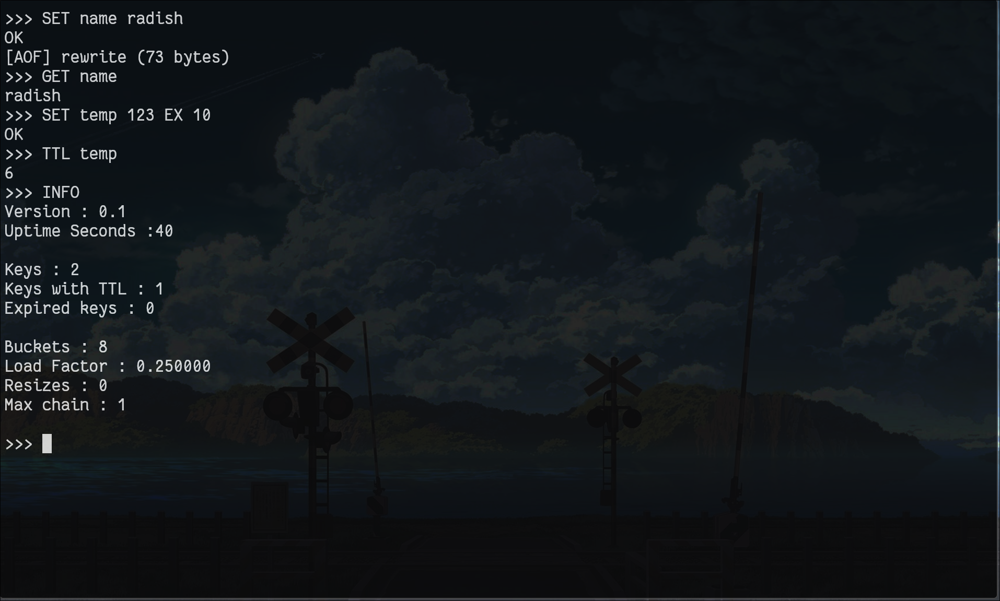

# RadishDB

RadishDB is a **Redis-inspired, in-memory key–value database** written in **C**, built to understand how real databases work internally and how to deploy them like production services.

RadishDB implements real storage engine internals and is fully **containerized and deployable using Docker and Docker Compose**.

This project focuses on:

* write-ahead logging (WAL)
* crash recovery
* expiration & TTL
* log compaction
* persistent storage
* containerized deployment (Docker)
* service orchestration (docker-compose)

RadishDB is a **learning-grade but architecturally serious** database, following patterns used in Redis, RocksDB, and PostgreSQL.

---

## Screenshots

### Interactive REPL



### TCP Server Mode


---

# Core Features

## Key–Value Storage

* String → string mapping
* Hash table with separate chaining
* Automatic resizing
* Heap-managed memory
* Safe insert, update, delete

---

## TTL & Expiration

* Per-key expiration timestamps
* Passive expiration on read
* Active expiration via sweeper
* Redis-style TTL semantics

---

## Persistence

RadishDB uses two persistence layers.

### Snapshot (.rdbx)

Binary snapshot of full database state.

Used for fast save and restore.

---

### Append-Only File (AOF)

Crash-safe write-ahead log.

Features:

* deterministic replay
* fsync durability
* partial write protection
* crash recovery

---

## AOF Rewrite (Log Compaction)

RadishDB implements log compaction:

* serializes current state
* writes new compact log
* removes obsolete history

This ensures:

* bounded disk usage
* fast startup
* crash safety

---

# Architecture

RadishDB is built as a protocol-agnostic execution engine.

```
engine.c      → command semantics
hashtable.c   → storage engine
aof.c         → durability
expires.c     → TTL system
persistence.c → snapshots
repl.c        → interactive mode
server.c      → TCP server
main.c        → lifecycle
```

This separation allows multiple frontends:

* REPL
* TCP server
* container deployment
* future protocols

---

# Supported Commands

```
SET key value
SET key value EX seconds
GET key
DEL key
TTL key
COUNT
SAVE file
LOAD file
BENCH n
INFO
HELP
EXIT
```

---

# Example Session

```
SET name radish
OK

GET name
radish

SET color red EX 10
OK

TTL color
7
```

After restart:

```
GET name
radish
```

State recovered from AOF.

---

# Build and Run (Native)

Build:

```bash
make
```

REPL mode:

```bash
./radishdb
```

Server mode:

```bash
./radishdb --server
```

Server listens on port 6379.

---

# Run Using Docker (Recommended)

RadishDB is published on Docker Hub.

Pull image:

```bash
docker pull piee314/radishdb:latest
```

Run container:

```bash
docker run -d \
  --name radishdb \
  -p 6379:6379 \
  -v radish-data:/app/aof \
  piee314/radishdb:latest
```

This starts RadishDB with:

* persistent storage
* exposed network port
* isolated container runtime

---

# Persistence

RadishDB stores data in:

```
/app/aof/radish.aof
```

Docker volume ensures data persists across container restarts.

List volumes:

```bash
docker volume ls
```

Inspect volume:

```bash
docker volume inspect radish-data
```

---

# Run Using Docker Compose

docker-compose.yml:

```yaml
version: "3.8"

services:
  radishdb:
    image: piee314/radishdb:latest
    container_name: radishdb
    ports:
      - "6379:6379"
    volumes:
      - radish-data:/app/aof
    restart: unless-stopped

volumes:
  radish-data:
```

Start service:

```bash
docker-compose up -d
```

Stop service:

```bash
docker-compose down
```

View logs:

```bash
docker-compose logs
```

---

# Container Architecture

RadishDB uses multi-stage Docker build:

```
build stage → compile binary
runtime stage → minimal Linux container
volume mount → persistent storage
```

Benefits:

* small image size
* fast startup
* production-ready deployment

---

# DevOps Features Demonstrated

RadishDB demonstrates real DevOps practices:

* Docker containerization
* multi-stage builds
* persistent volumes
* Docker Hub image publishing
* docker-compose orchestration
* reproducible deployments

RadishDB can run identically on:

* local machine
* cloud servers
* CI/CD pipelines
* container orchestration platforms

---

# Project Structure

```
src/
├── engine.c
├── hashtable.c
├── aof.c
├── expires.c
├── persistence.c
├── repl.c
├── server.c
├── result.c
├── utils.c

Dockerfile
docker-compose.yml
Makefile
README.md
ARCHITECTURE.md
LEARNINGS.md
```

---

# Deployment Example (Cloud Server)

On any Linux server:

```bash
docker run -d \
  -p 6379:6379 \
  -v radish-data:/app/aof \
  piee314/radishdb:latest
```

RadishDB runs remotely and persists data.

---

# Status

Stable learning release.

Fully functional storage engine with persistent container deployment.

---

# License

MIT License

---

# Author

Built as a systems engineering and DevOps learning project to understand:

* database internals
* crash recovery
* persistence
* containerization
* deployment workflows

